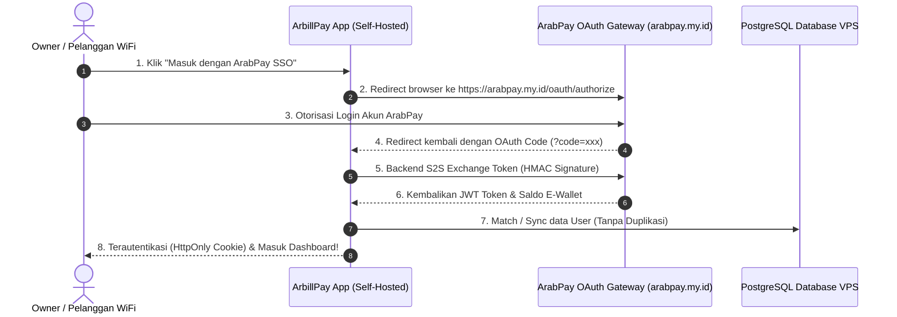

# 🚀 ArbillPay — Open Hotspot Billing SaaS Platform (Locked by ArabPay SSO)

[](https://opensource.org/licenses/MIT)
[](https://arabpay.my.id)
[](https://www.typescriptlang.org/)
[](https://react.dev/)
[](https://www.docker.com/)

**ArbillPay** adalah platform SaaS manajemen tagihan WiFi, kasir POS voucher, dan billing hotspot open-source yang dapat disebar dan didistribusikan secara bebas. Aplikasi ini secara eksklusif dikunci dan terintegrasi dengan **ArabPay E-Wallet Platform (`https://arabpay.my.id`)** untuk otentikasi login satu pintu (SSO), manajemen transaksi, dan sinkronisasi saldo otomatis.

---

## 🌟 Fitur Utama (Key Features)

- 🔒 **ArabPay Single-Sign-On (SSO):** Otentikasi terenkripsi HMAC-SHA256 & JWT S2S. Bebas pendaftaran manual ribet!
- 💳 **Saldo Real-Time ArabPay:** Badge saldo real-time di Top Header, Dropdown Profil, & Dashboard KPI Overview.
- 📋 **Tombol 1-Click Salin ID ArabPay:** Salin ID Pengguna ArabPay unik dengan 1 klik untuk konfigurasi role Owner.
- 🏪 **Point of Sales (POS) Hotspot:** Cetak voucher fisik / digital super cepat untuk loket kasir.
- 📱 **Portal Pelanggan WiFi ("Tagihan Saya"):** Pelanggan dapat mengecek tagihan, status kuota, dan bayar 1-click via ArabPay/QRIS.
- 👑 **Peran Owner Otomatis (Hybrid Owner Role):** Hak akses Super Admin ditentukan otomatis via `ARABPAY_OWNER_USER_ID` di `.env` atau pendaftaran user pertama.
- 🛡️ **Bcrypt Encrypted & HttpOnly Cookie:** Proteksi keamanan tinggi bebas serangan XSS / Session Hijacking.

---

## 🏗️ Arsitektur Integrasi ArabPay SSO



---

## 💻 Panduan Instalasi & Deployment (Self-Hosted)

### 1. Dapatkan Kredensial Developer di ArabPay Panel
1. Login ke **ArabPay Panel** 👉 [https://arabpay.my.id/dashboard?tab=credentials](https://arabpay.my.id/dashboard?tab=credentials).
2. Klik **"+ Tambah Aplikasi"**, buat aplikasi baru (contoh: *ArbillPay Hotspot*).
3. Atur Redirect URI: `http://<vps-domain-anda>:3005/#/oauth/callback`.
4. Dapatkan **`Client ID`** (contoh: `AP24542931`) dan **`Client Secret`**.

### 2. Salin ID Pengguna ArabPay Owner
Salin ID Pengguna ArabPay Anda dari menu profil ArabPay (contoh: `019f74af9fcdWDgDxM8g`).

### 3. Konfigurasi Environment File (`.env`)
Buat file `.env` di direktori proyek:

```env
# Server Configuration
PORT=3006
VITE_API_URL=http://localhost:3006

# PostgreSQL VPS Database
DB_HOST=30.30.0.175
DB_PORT=5432
DB_USER=postgres
DB_PASSWORD='password_db_vps'
DB_NAME=arbil_db

# ArabPay OAuth Credentials (Kemitraan Resmi)
ARABPAY_CLIENT_ID=AP24542931
ARABPAY_CLIENT_SECRET='secret_dOAZFeFW$bC'
ARABPAY_PANEL_URL=https://arabpay.my.id
ARABPAY_REDIRECT_URI=http://localhost:3005/#/oauth/callback

# 👑 Owner ArabPay User ID (User dengan ID ini otomatis diangkat sebagai Owner Super Admin)
ARABPAY_OWNER_USER_ID=019f74af9fcdWDgDxM8g
```

### 4. Jalankan Aplikasi

#### Menggunakan Docker Compose (Direkomendasikan):
```bash
docker-compose up -d
```

#### Menggunakan Node.js / NPM:
```bash
# Install dependencies
npm install

# Jalankan Backend API Server (Port 3006)
npm run server

# Jalankan Vite Dev Server (Port 3005)
npm run dev
```

---

## 🛠️ Tech Stack

- **Frontend:** React 19, TypeScript, TailwindCSS v4, Lucide Icons, Vite
- **Backend API:** Node.js, Express, TypeScript, Bcrypt, Cookie-Parser
- **Database:** PostgreSQL (VPS Direct Connection)
- **SSO Gateway:** ArabPay E-Wallet OAuth 2.0 (HMAC-SHA256 Signed S2S Exchange)

---

## 📄 Lisensi (License)

ArbillPay didistribusikan di bawah lisensi [MIT License](LICENSE). Bebas dipakai, dimodifikasi, dan disebarkan kembali dengan syarat tetap menggunakan otentikasi ArabPay SSO Gateway.
